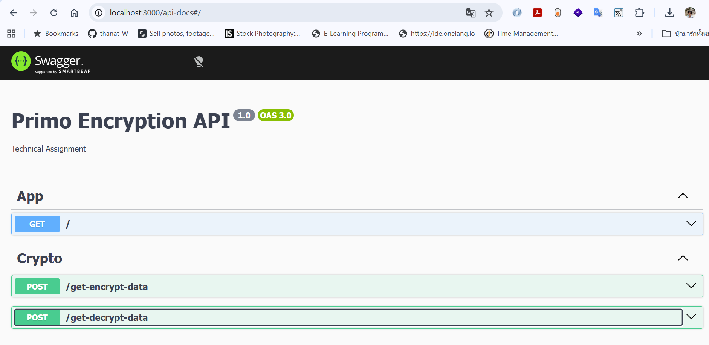

# NestJS Encryption Service

## Overview

This project provides two APIs:

* POST `/get-encrypt-data`
* POST `/get-decrypt-data`

The service uses:

* NestJS
* RSA Public/Private Key
* AES-256 Encryption
* Swagger API Documentation
* Unit Testing with Jest

---

## Prerequisites

* Node.js 18+
* npm

Verify installation:

```bash
node -v
npm -v
```

---

## Installation

Clone repository:

```bash
git clone https://github.com/thanat-W/nestjs-encryption-service.git

cd nestjs-encryption-service
```

Install dependencies:

```bash
npm install
```

---

## RSA Keys

Create a `keys` folder in the project root:

```text
keys/
├── private.pem
└── public.pem
```

Generate RSA key pair from:

https://cryptotools.net/rsagen

Place generated keys into the corresponding files.

---

## Run Application

Development mode:

```bash
npm run start:dev
```

Application will be available at:

```text
http://localhost:3000
```

---

## Swagger Documentation

Swagger UI:

```text
http://localhost:3000/api-docs
```

---

## API Specification

### POST /get-encrypt-data

Request:

```json
{
  "payload": "Hello World"
}
```

Response:

```json
{
  "successful": true,
  "error_code": "",
  "data": {
    "data1": "...",
    "data2": "..."
  }
}
```

---

### POST /get-decrypt-data

Request:

```json
{
  "data1": "...",
  "data2": "..."
}
```

Response:

```json
{
  "successful": true,
  "error_code": "",
  "data": {
    "payload": "Hello World"
  }
}
```

---

## Validation

### Encrypt Request

* payload is required
* payload length must be between 1 and 2000 characters

### Decrypt Request

* data1 is required
* data2 is required

---

## Running Tests

Run all tests:

```bash
npm run test
```

Run tests with coverage:

```bash
npm run test:cov
```

---

## Project Structure

```text
src/
├── crypto/
│   ├── crypto.controller.ts
│   ├── crypto.service.ts
│   ├── crypto.module.ts
│   └── dto/
│       ├── encrypt.dto.ts
│       └── decrypt.dto.ts
│
├── app.module.ts
└── main.ts

keys/
├── private.pem
└── public.pem
```

---

## Error Handling

Example error response:

```json
{
  "successful": false,
  "error_code": "DECRYPT_ERROR",
  "data": null
}
```

---

## Technologies

* NestJS
* TypeScript
* Jest
* Swagger
* Node.js Crypto

# Swagger



```
```
